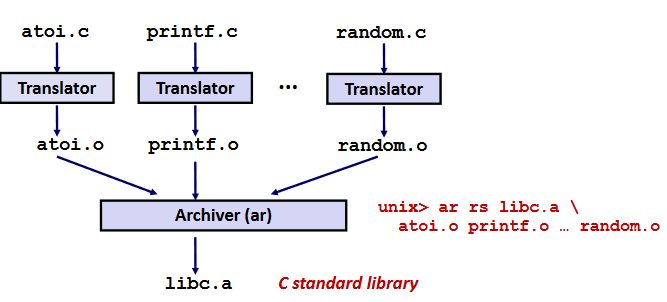
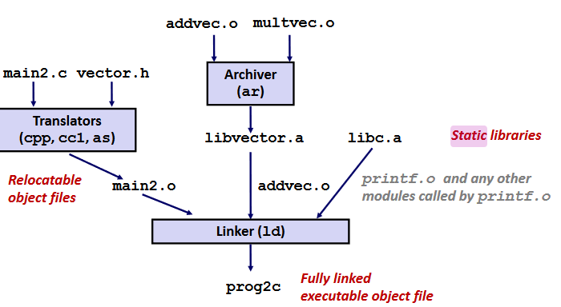
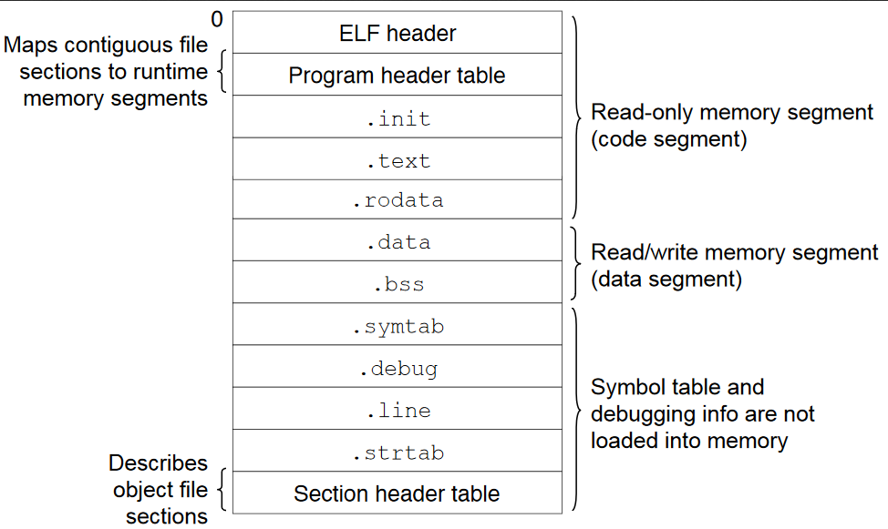
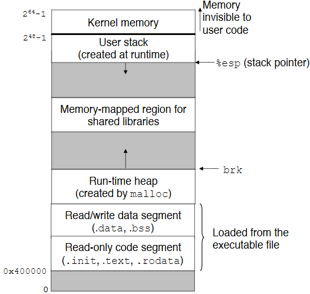

# 1. 基本概念
## 1.1 静态链接主要任务
* 符号解析（symbol resolution）：连接目标文件里的符号的引用和定义。每个符号对应一个函数、全局变量或静态变量（static）。

* 重定位（relocation）：linker将各目标文件的每个符号重新合并排布到内存位置上，并修改符号的引用使之指向内存中。

## 1.2 目标文件
目标文件有三种类型：
1. 可重定位目标文件`.o`
2. 可执行目标文件`a.out`
3. 共享目标文件`.so`

## 1.3 ELF格式
以上三种目标文件在Linux中的统一格式为ELF。


## 1.4 符号和符号表

可重定位模块中符号有以下三种：
* **全局符号（Global symbols）：**本模块中定义，可被其他模块引用的符号。（如non-static函数和全局变量）
* **外部符号（External symbols）：**外部模块定义，m中引用的符号。
* **本地符号（Local symbols）：**只能本模块使用（static函数和全局变量）

# 2. 链接过程
链接过程由符号解析和重定位组成
## 2.1 符号解析
一个模块定义的符号记录在符号表中，链接时符号解析为确定那些全局符号在哪些模块中。

### 解决重名的全局符号
当多能被多模块引用的全局符号有重名，解决方法是将符号分为两类：
1. 强（strong）符号：已初始化全局符号
2. 弱（weak）符号：未初始化全局符号

Linux链接器按如下规则处理：
* 不允许多个同名强符号（报错）
* 强符号弱符号重名，则选强符号
* 多个弱符号重名，则任意选择一个

### 静态库链接
静态库`.a`文件是多个`.o`文件的打包（archive）。


相比于链接时用`.o`文件当输入，静态编译只从静态库中自动选出用到的目标文件部分，并且不需输入多个`.o`。省空间且方便。


**编译参数注意！**
包含被引用符号的文件要放后，因为链接器按以下方式解决引用：
* 链接器从左到右扫描作为命令行参数的`.o`和`.a`文件
* 每个被扫描到的文件，都拿来匹配一个包含和先前扫描时未解决符号的列表
* 该列表最终非空则链接错误

所以，库文件要放在链接器参数最后

## 2.2 重定位
不同目标文件的section被合并后成为一个新的聚合section，并分配到内存的某一位置。

**重定位项（Relocation entry）**
汇编器遇到未知引用时，生成一个重定位项。
代码的重定位条目在.rel.text，数据的重定位条目在.rel.data

# 3. 加载可执行目标文件
可重定位目标文件被链接成可执行目标文件，ELF可执行文件格式类似于ELF可重定位，如下：


其中
* ELF头包含文件总格式和 *entry point*
* 程序头表（head table）包含 section 被映射到内存中的位置
* .init节包含函数 _init，是程序的初始化代码

**加载可执行目标文件**

加载器loader执行过程：
1. loader根据 program header table将 sections 复制到内存

2. 跳到入口点的 `_start`函数，其调用 系统启动函数`__libc_start_main` 初始化环境，再调用用户代码的`main`，并处理其返回值给内核


# 4. 共享库
程序的 .interp sectionn 包含 dynamic linker 的路径（该 linker 自身就是一个动态库 ld-linux.so）。loader 先加载 dynamic linker，之后 linker 将动态库的内容复制到内存中。

程序可以在编译时指定共享库，也可以在运行时通过 dlopen(), dlsym() 等函数使用一个共享库文件。

# 5.库打桩
库打桩（Library interpositioning）机制可以截获对库的调用，转而执行自己的代码。
有在编译、链接、运行时候进行打桩的三种方式。

* **编译时打桩**
在头文件中用宏定义 #define ，让自己的函数替换掉目标函数。如：
```
#define malloc(size) mymalloc(size)
```
并且编译时通过`-I.`选项搜索该头文件

* **链接时打桩**
通过链接时替换引用的符号完成打桩。
通过用链接器的`--wrap func`选项实现如下行为：
 * 把符号`func` 解析 `__wrap_func`（自定义函数）
 * 把`__real_func`解析成`func`（目标函数）
 
 使用方法为：
 ```
 gcc -Wl,--wrap,func1 -Wl,--wrap,func2 -o prog prog1.o prog2.o
 /* -Wl,option 把option的内容传给链接器，且用空格代替逗号 */
 
 ```

* **运行时打桩**
通过修改动态链接器的环境变量 LD_PRELOAD，指向自定的动态链接库。
使用方法为：
```
(shell)linux > LD_PRELOAD="./mymalloc.so" ./prog
```