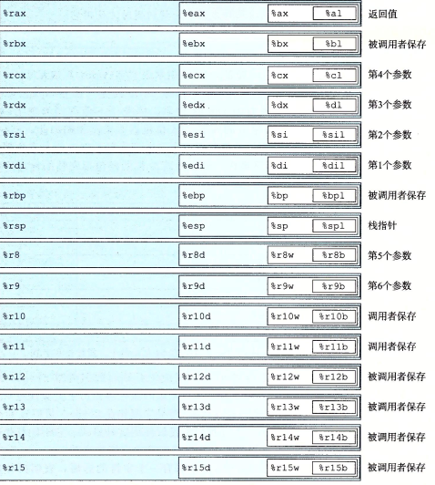
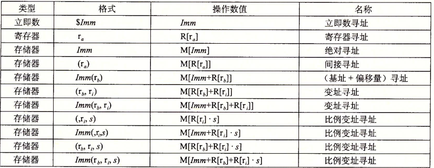
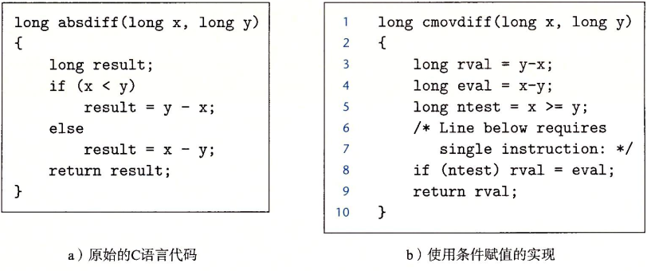
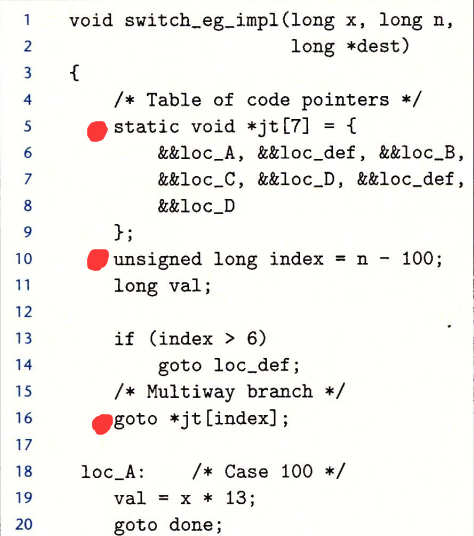
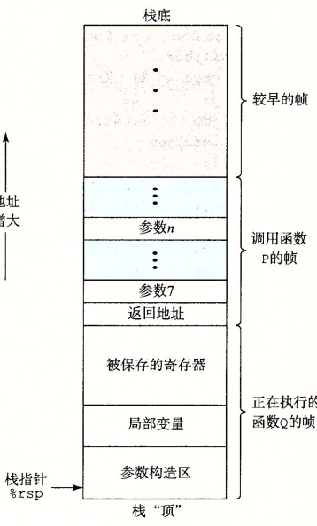

# 1. 访问信息
**x86寄存器：**

**操作数格式：**

**注意事项**
* movl（四字节移动）以寄存器为目的操作数时，会使该寄存器高32为复位0
* 两操作数不能都是内存

leap 第一个操作数并非引用内存地址，只是为了方便简易乘法

# 2. 控制

## 2.1 跳转指令
跳转可以直接跳转，也可以间接读寄存器的值跳到相应内存

>jmp *%rax    -----跳到rax内值对应的内存
jmp *(%rax)   ·····读rax值对应内存里的值来跳转

## 2.2 条件传送实现条件分支
用if-else式分支控制在现代处理器上可能略有低效，因为会打乱流水线。所以可以使用一个**条件变量**保存结果到最后判断是否执行某步骤，保持顺序性。

实际上因为在一些情况下不一定够好，gcc只有条件结果是单一语句才这么处理if-else。

## 2.3 switch语句实现
当条件分支足够多，且待判断数据 n 相差不大时会编译器会使用jump table，这个数组里存储有各分支地址，通过对 n 运算得出table的下标。

# 3. 过程
函数、处理程序等称为*过程*，要对过程的控制要完成如下几个方面：
1. 传递控制：被调函数起始地址、返回调用函数的地址
2. 传递数据：参数、返回值
3. 分配和释放内存：为局部变量等分配空间，返回时释放

## 3.1 运行时栈

调用中每个过程会在栈上形成栈帧，存储需要的临时信息，大多数栈帧在过程开始就分配好了。
编译器出于对效率考虑，x86-64过程中对参数、局部变量较少的函数甚至可能根本不分配frame，直接用寄存器存储变量。

## 3.2 转移控制、数据
将调用时将返回地址存入stack中，再转跳到新函数。
函数的返回值存在%rax中。

函数调用传递参数时，小等于6个的参数根据顺序和字长存在对应的寄存器中，大于的部分放在栈里。

# 4. 数据类型的分配与结构

## 4.1 多维数组：
多维数组 a[N][M] 有两种内存形式：

* **定长数组（Nested array）：**
定义时确定长宽，此时每个元素是按行优先并列排布。
a[i][j] = Mem(a + i x N + j)。

* **变长数组（Multi-level array）：**
C99中可在数组定义时使用变量确定大小，实现变长数组
可用malloc申请指针数组作行，再malloc列数组。
虽然访问时表达式一致，但内存分配不同

## 4.2 数据对其：
为了增加访问效率，数据在内存中的位置必须是其字节大小的整数倍，如int的地址为4的整数倍，double为8的整数倍。

# 5. 内存越界和缓冲区溢出
当输入的数据的大小超过容纳数组的大小，多出的数据会覆盖栈上的其他内容。一些攻击方式便是又此产生：

1. 代码注入：输入的字符串中有可执行代码，溢出的内容覆盖返回地址，使之跳到栈上的该可执行代码处。

2. ROP攻击：因为栈随机化、禁止执行栈上代码等保护措施，所以通过不停转跳到程序本身已有的函数代码片段（该代码以0xc3即ret结尾来不停转跳），利用片段一步步组合成攻击代码。

避免方法：使用fgets()读取字符串，避免缓冲区溢出。