**页表项（Page Table Entry-PTE）：**页表中的一项（带有有效位、保护位、对应物理地址）

**虚拟页表号（Virutal Page Number-VPN）：**页表项在页表中的位置

**翻译后备缓冲器/快表（Translation Lookaside Buffer-TLB）：**因为页表存在内存中访问速度缓慢，所以在MMU中有一个针对页表的小缓存TLB

# 1. 地址翻译
带TLB的翻译步骤如图，其中当TLB不命中时从L1缓存中取出一项代替TLB中的一个已存在项。

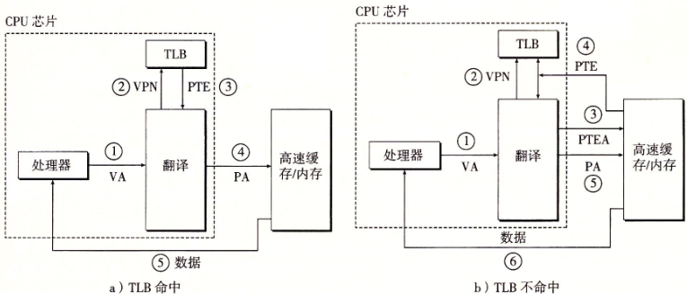

**多级页表**
多级表可以节省空间，因为如果一级表的一个PTE是空的，则其对应的二级表不存在。因为TLB所以速度相比单级表并不会慢很多。
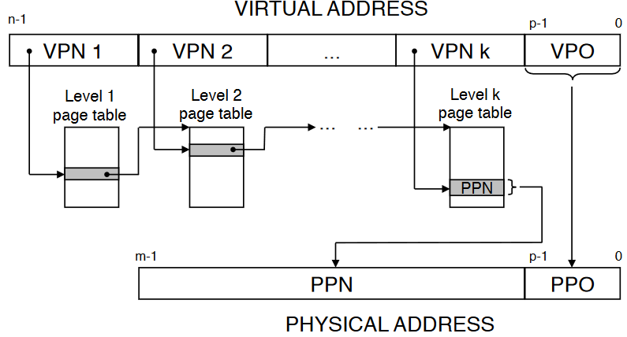

# 2. 内存映射
将磁盘上的对象映射到虚拟内存区域上称为内存映射（memory mapping）。虚拟内存区域上的初始化值来源有二：
* **普通文件：**文件的 section 被分页后映射到内存页框

* **匿名文件（不存在的）：**内容不来自实际文件的内存为匿名内存（anonymous memory），如栈，bss节。内核在idle中会将其内容都复位0

## 2.1 内存的共享对象
为了防止空间浪费，不同进程中相同的区域并不重复存储，而是共用物理内存上的一个对象。
对象被映射到虚拟内存中，要么是共享对象（shared object），要么是私有对象（private object）。

### 共享对象
多个进程共享同一个物理内存上的对象，一个进程对其的修改也会反映到其他进程上。
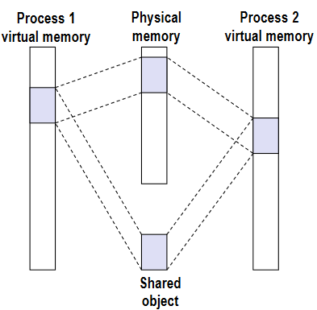

### 私有对象
一个进程对其私有对象的修改，对其他进程不可见。

内存的私有对象初始化时和共享对象一样，由多个进程共享该物理内存副本。只在修改对象中的页面时才在物理内存的其他地方新建该页面，该技术称为写时复制（copy on write)。
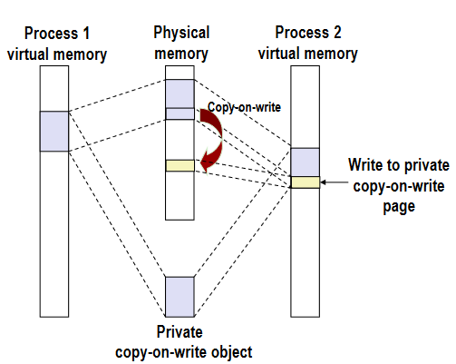

# 3. 显式动态内存分配
堆被分配器视为不同大小的块（blocks，每次*malloc*、*free*出的内存都是一个块）的集合，分别为**空闲块**、**已分配块**，用于分配或释放。
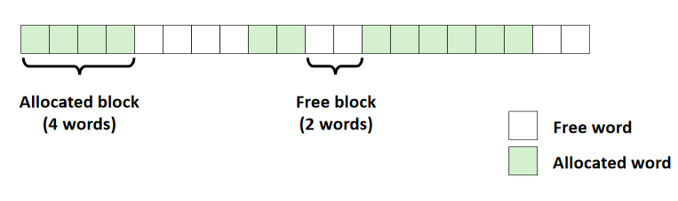

显式分配即需要程序手动释放已分配块，其有如下限制：
* 不能控制已分配块的大小、数量
* 立即响应请求（不允许为了性能而缓存或重排请求）
* 只从空闲内存中申请块
* 块必须对齐，因此可能要填充（x86-64Linux中16字节对齐）
* 只能操作、修改未分配的内存
* 不能移动已分配块

同时还要在分配释放吞吐率、内存利用率中达到平衡。
其中影响利用率的是内存碎片（fragmentation），碎片有两种形式：
1. **内部碎片（internal fragmentation）：**块内部的碎片，如块大小区和对齐填充的部分。
2. **外部碎片（external fragmentation）：**块外部的，没有足够用于分配的单个空闲块。

## 3.1 实现
分配器设计需要考虑四点：
* 组织：如何记录空闲块
* 放置：如何找一个合适的空闲块放置新分配块，有最前、最近、最佳三种方式。
* 分割：放置后如何处理空闲块剩余部
* 合并：如何处理刚释放的块

### 隐式空闲列表（Implicit free list）
每个空闲/分配块都有一个结构，包含块大小、块类型、块内容。
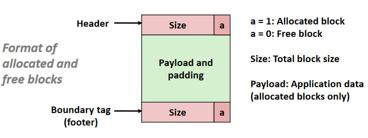

通过其大小size来隐式追踪每一个空闲块。
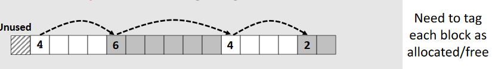

### 显式空闲列表（Explicit free list）
空闲块中有前驱、后继空闲块的指针，得以使时间从块数线性时间减至空闲块数线性时间。同时因为有指针，块在内存的顺序无关紧要。
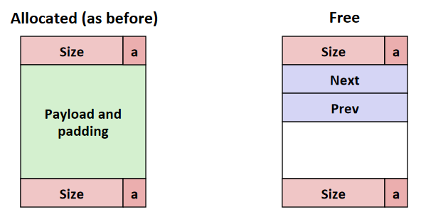

### 分离空闲链表（Segregated free lists）
为了将分配时间减到更少，根据块大小建立多个链表。
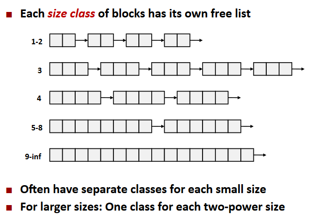

当分配器需要大小为n的块时，便搜索相应链表找到一个大于n的块并放置。没有则搜索下一个链表。如果所有链表都没有则通过 *sbrk()* 从堆中申请空间。

# 4. 垃圾收集器
GC将内存视为有向图，分两类结点：
* 堆节点：代表一个堆中分配的block
* 根节点：包含指向堆块的指针，但不在堆中的（可能在寄存器、栈、全局变量区）

且p → q 代表p块中有指向q块的指针
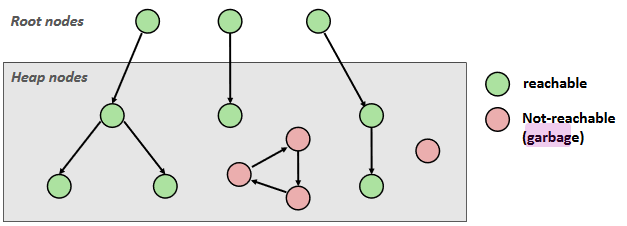

对于不与根节点间接相连的堆节点，没有能找到其的指针，所以肯定是垃圾且能被回收。

## 4.1 Mark&Sweep 垃圾收集器
在new操作找不到合适块时执行。
Mark阶段标记根节点所有可达后继，Sweep阶段清除所有没被标记到的。
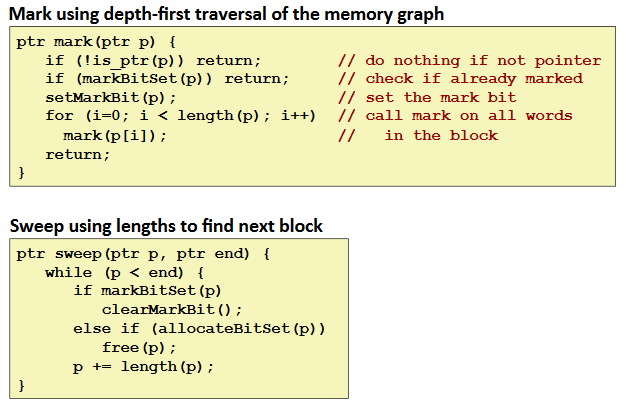

因为在C语言中无法确定一个变量是否是指针（*is_ptr()* )，所以可以维护一个二叉树来解决。
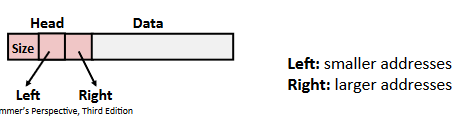