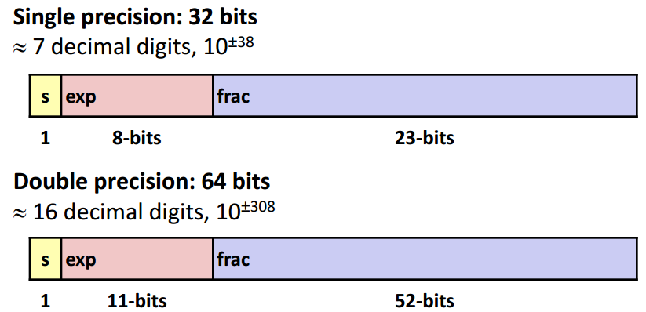
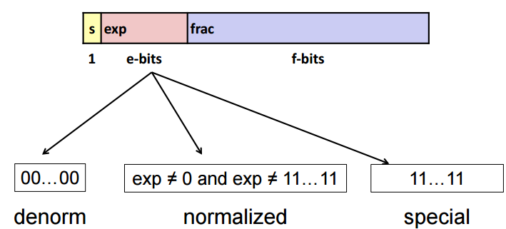
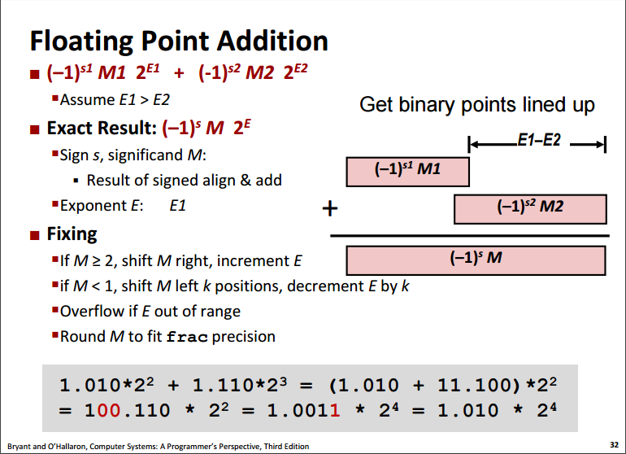
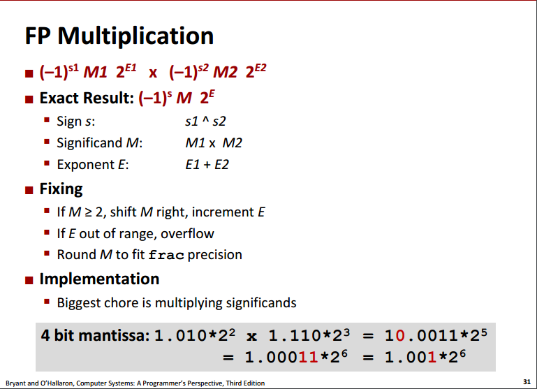

# 1. 整数的表示

* 无符号整数：对应的二进制数
* 有符号整数：补码

## 1.1 类型转换
有符号整数和无符号整数相互强制转换时：
* 不对数据每一个字节的位修改，仅是改变解释这些位的方法。
* 比较、运算等表达式分别有无符号和有符号整数时，会强制转换成无符号。

因此使用时必须考虑符号、取值范围溢出等问题。

C语言中数字默认是有符号，因此要对无符号整数赋值应该在最后加上"u"，如：
`
unsigned int ui = 4321u; 
`
## 1.2 整数运算
**无符号加法：**两个无符号数相加，如果结果位数大于无符号类型最大长度w，则截断与w处，再把结果解释为无符号类型。
 * 检测无符号加法溢出：对于s = x + y，当且仅当x  0, y > 0，s = 0时正溢出
 
**无符号乘法：**相乘如果位数大于最大位数w，则只截断于w位内，相当于取模。

**有符号乘法：**截w位后按补码解释。

# 2. 浮点数
IEEE754用如下形式定义浮点数：
> V = (-1)s&times;M&times; 2E
* 符号 s：0决定为正数，1为负数
* 尾数 M：二进制小数，范围[1,2)，由下图frac编码得来（但不相等）
* 阶码 E：2的E次幂，可正可负，由下图exp编码得来（但不相等）

## 2.1 浮点数表示
* 单精度和双精度浮点数内存表示：

* 单精度浮点数分类：

**规格化值：**
阶码`E = exp - bias`
* exp为无符号数
* bias = 2k-1 - 1（单精度127，双精度1023）。
  因此E的取值范围在单精度时是[-126,127]，双精度时[-1022,1023]  

尾数`M = 1 + f`
* frac为小数值 f，取值范围[0,1)，二进制表示为 0，fn-1 ···f0

**非规格化值：**
exp全为0时的情况，此时`E = 1 - bias`，`M = f`
非规格化可以表达0（这时有+0和-0），以及非常接近0的小数

**特殊值：**
* exp = 111…1, frac = 000…0时，表示无穷∞（有正负之分）
* exp = 111…1, frac ≠ 000…0时，表示NaN（不是一个数）

## 2.2 舍入
对于数字 x，想将其用浮点数表达必须减少精度做一定舍入，IEEE754默认舍入方式为**向偶舍入：**
* 舍去位=6时进位，=5时舍向最近的偶数

对二进制数 XXX…X.YYY…Yzz同理，舍入位后两位zz，
* zz>10进位， 

