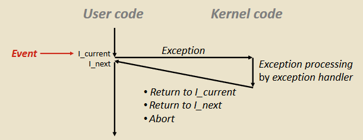
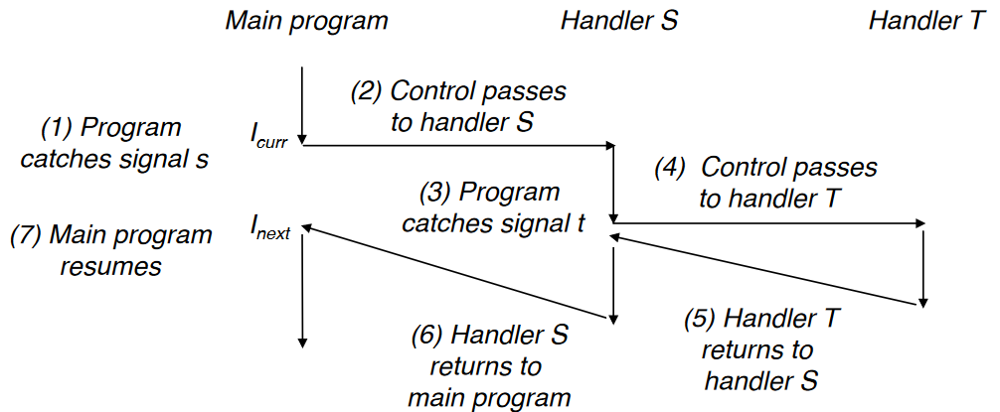

# 1. 异常
**异常（Exception）**即程序控制流中的突变，如由缺页/除零/IO中断等软硬件事件引发。

每次异常发生时都会根据起始地址在CPU寄存器 exception table base register 的异常表（中断向量表），调用异常处理函数（exception handler）
* 每种异常都有一个唯一的异常号 k
* 发生异常时，以异常号 k 为索引，找到并运行异常表里的处理函数（在内核态中）。

## 1.1 异常种类
异常有同步、异步两类；中断、陷阱、故障、终止四种：
* 异步异常（外部I/O事件）：中断
* 同步异常（指令执行产生）：陷阱、故障、终止

**1. 中断（interrups）**
外部I/O事件引起
**2. 陷阱（traps）**
有意的异常，执行一条指令的结果。如：系统调用
**3. 故障（faults）**
由错误引起，可能能被处理程序修复。成功则返回程序继续，失败则启用 abort。如：缺页异常
**4. 终止（aborts）**
不可恢复的故障，通常是硬件错误。直接调用 abort 例程终止程序。

# 2. 信号概念
信号是一种更高级的异步异常，能把系统里某类事件的类型通知给进程，允许内核或进程中断其他进程。

* **发送：**内核检测到某事件（或某进程调用 kill），通过更新目的进程上下文的某个状态来发送信号

* **接收：**目的进程可忽略、终止或调用 *用户级* 的 signal handler

信号传送的信息只有信号ID和已到达的事实。
* **待接收信号（pending signal）：**已发出而未接收。一进程如果有任类型 k 的待接收信号，其他被送到该进程的 k 类型信号都会被抛弃（不存在接收队列）
* **阻塞信号（blocking signal）：**进程也可阻塞类型 k 信号，虽信号可发出，但取消阻塞后才能被接收

进程中维护着数据结构 pending vector 和 blocking vector 、 blocking set来表示信号状态

## 2.1 收发信号
**进程组：**每个进程只属于一个进程组，默认子进程和父进程属一个进程组。

* **发送信号：**
进程用 kill() 、alram() 函数发送信号给进程或进程组

* **接收信号：**
进程从内核态回到用户态时，检查非阻塞的待接收信号集合（pending & ~blocking)，非空则强制接收其中一信号。
可以通过 signal() 函数修改默认的 signal handler。且信号处理函数可嵌套。

## 2.2 阻塞/解除信号
当信号 s 正在被处理函数 S 处理时，内核阻塞任何待接收的其他 s 信号（即不能 handler 被同类型的 handler 嵌套）,直到处理函数 S 结束。

使用 sigprocmask() 等函数操作

## 2.3 安全的信号处理程序
信号处理程序和主程序可能是并发的，如果有共享的全局变量将会竞争。所以要遵守一些准则。

* 规则 1：信号处理器越简单越好
 * 例如：设置一个全局的标记，并返回
* 规则 2：信号处理器中只调用异步且信号安全(async-signal-safe)的函数
 * 诸如 `printf`, `sprintf`, `malloc` 和 `exit` 都是不安全的！
* 规则 3：在进入和退出的时候保存和恢复 `errno`
 * 这样信号处理器就不会覆盖原有的 `errno` 值
* 规则 4：临时阻塞所有的信号以保证对于共享数据结构的访问
 * 防止可能出现的数据损坏
* 规则 5：用 `volatile` 关键字声明全局变量
 * 这样编译器就不会把它们保存在寄存器中(见apue的longjump章)
* 规则 6：用 `volatile sig_atomic_t` 来声明全局标识符(flag)
 * 这样可以防止出现访问异常

# 3. 非本地跳转
如 setjmp, longjmp 之类的函数