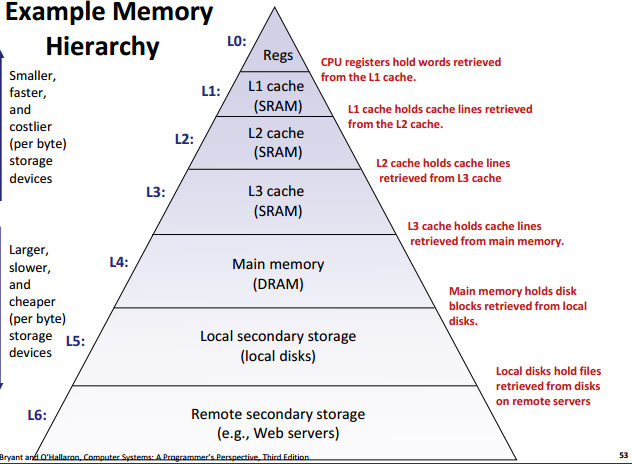
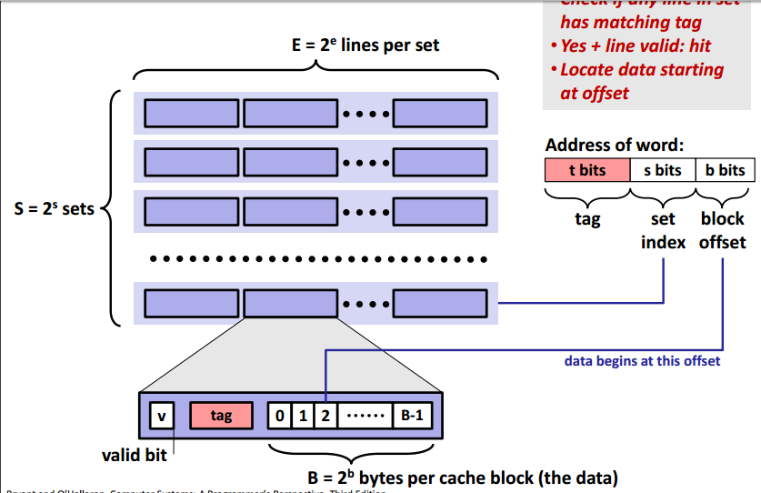
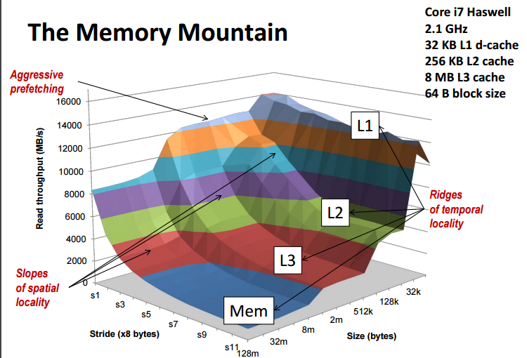

# 1. 缓存概念
存储器结构中，每一层存储器都作为下一层更慢更大的存储器的缓存，如主存之于磁盘。

第k+1层存储器被连续地划分为多个块（block），且块具有各自编号。
较小快的第k层同样划分多个块，块大小等同k+1层块，但数量更少，是k+1层块集合的子集。

**缓存不命中种类：**
每次不命中，都会引起放置操作。对于块放置策略，定位方式实现昂贵，而其他方法则会有如下冲突：

1. 冲突不命中（conflic miss）：要访问的不同数据的块们都根据某种策略被映射到同一缓存块中
2. 容量不命中（capacity miss）：缓存太小

# 2. 高速缓存通用结构

高速缓存由三参数确定：
* S：高速缓存组数量，S = 2s
* E：每组的高速缓存行数量。
* B：高速缓存块大小，即每一行的字节数量，B = 2b

每行还有有效位v确定该行是否有意义，和t位大小的tag做标号。总容量C = S&times;E&times;B。

# 3. 高速缓存操作

**读：**
对于要读取的数据的m位地址，分为t、s、b位的三部分：
1. s位部分作为组索引
2. 依次判断各行的v有效否及tag是否匹配，如果没有命中的则置换
3. b位部分作为偏移确定数据块中开始读数据的位置

**写：**
对于要写的字w，先在高速缓存中更新内容，接着有两种更新下一层存储器的方式：
1. 直写（write-through）：直接马上写到下一级存储器中，但总线流量消耗大。
2. 回写（write-back）：推迟更新，当更改后的行要被置换时才写到下一级存储器。因为局部性所以有利总线流量，但要额外一个dirty bit表示是否修改过。

针对写不命中（要写的位置不在高速缓存行中)的问题，同样也有两种解决方法：
1. 写分配（write-allocate)：先加载低一层到高速缓存，再对高速缓存写，与*回写*搭配。
2. 非写分配（non-write-allocate）：跳过高速缓存直接写到内存中，与*直写*搭配。

建议程序员心中采用回写-写分配的模型。

# 4. 高速缓存对程序性能的影响
## 4.1 存储器山

1. 时间复杂度：处理的数据大小、能否一次放入缓存
2. 空间复杂度：处理的步长

这两个要素结合各级缓存对吞吐量有影响，形成一个三位坐标轴中的**存储器山**，该山根据CPU、存储器系统不同而不同。

## 4.2 程序中利用局部性

* 注重内循环
* 根据顺序用步长1访问增加空间局部性
* 一个数据对象从存储器读入后尽量多使用，增加时间局部性