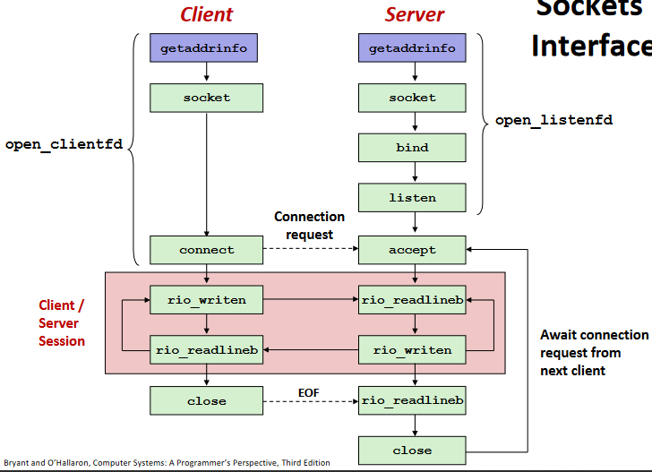

# 1. 套接字接口

其中 *socket()* 、 *connect()*、 *bind()* 的参数，应用 *getaddrinfo()* 提供，增加可移植性。
*getaddrinfo()*：根据主机名、地址等获取对应的套接字地址
*getnameinfo()*：根据套接字地址获取主机名、地址等
*freeaddrinfo()*：对应*getaddrinfo()* 使用

*listen() * 返回的是监听套接字，表示可待接收了；而*accept() *返回的是连接套接字，可以用来读写处理。

# 2. Web服务器
Web客户端和服务器以HTTP协议通信。
客户端返回的内容带有一个描述性的MIME类型。

## 2.1 HTTP事务
**HTTP请求**
一个请求行(request line)，后跟随多行（个）的请求报头(request header)，最后以空行结尾。

请求行：`  `
请求报头：`: `

**HTTP响应**
一个响应行（respond line），跟随多个响应报头（respond header），一个终结报头的空行以及一个响应主体（respond body）。

响应行：`  `

## 2.2 动态内容
CGI（Common Gateway Interface）标准用于解决服务器动态内容的参数、结果传递等问题。CGI程序（多由脚本编写）有大量环境参数，运行时能设置这些参数达到传递目的。