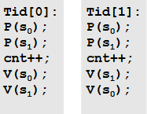

# 1. 基于进程的并发
服务器的父进程每次创建一个子进程服务客户端响应。
特别应注意父进程对资源的回收，如SIGCHLD处理程序回收僵死子进程，关闭被子进程复制的已连接描述符connfd。

# 2. 基于I/O多路复用的并发
I/O多路复用用于响应多种独立的I/O事件（如连接客户端和等待文字输入），而不会使程序阻塞在对某类型事件的等待中。
如*select() *将内核挂起，待某I/O事件发生后才将控制权返回。

**基于多路复用的状态机**
* 状态机由状态（state）、输入事件（input event）和转移（transition）组成，转移将输入事件和状态映射到新状态中。
* 配合*select() *，有新客户端接入时创建一个新的状态机，加入状态机池。接入的客户端有要求时，服务器就为相应状态机转移（执行一些响应动作）。

I/O复用能对多客户端（用数据结构表示各客户端）、多类I/O事件（*select() *）做出响应，且可以是单进程，省去调度开销，共享数据。但要其中的操作不应持续太久避免阻塞。

# 3. 基于线程的并发
线程方式融合以上两种的特点，既可由内核调度又可共享数据结构。

每个线程都有自己的线程上下文，线程之间能共享虚拟内存中除栈外的其他区域（尽管通过指针也能访问其他线程的栈）。因此线程之间:
* 共享同一个全局变量、局部静态变量
* 不共享各自局部自动变量

服务器处于并发考虑，为不显式等待新线程结束，新线程多设置为可分离（*pthread_detach() *），由系统对其回收。

# 4. 线程并发事项
并发访问共享资源时，因为无法预料系统如何调度，必须进行同步避免竞争。

## 4.1 信号量同步
针对信号量s的两种操作，操作执行时不能被中断：
* P(s)：s非零时减一，s为零时挂起线程且被V操作唤醒后s减一
* V(s)：s加一，有阻塞等待的线程便唤醒

初始化为1的信号量可以作互斥锁。同时信号量也能解决消费者-生产者，读者-写者问题。

## 4.2 线程提升并行
线程并发在多处理器下性能更好，不仅可以做如上的并发响应，还能用并发加快运算速度。

一个基本思路是先将计算任务分割后，分别给予创建出的不同线程，线程将运算结果保留给主程序分配给它们的存储空间后，由主程序合并。其中应尽量用独立变量代替共享变量，避免加锁带来的性能问题。

## 4.3 同步需要考虑的问题
### 4.3.1 线程安全
线程中调用的函数必须是“线程安全”的。线程不安全根源是多线程对全局变量或静态变量的引用，或者其中调用别的线程不安全函数。

**解决方法：**
* 可重入化，即不含全局变量或静态变量。可让调用者通过参数提供指针用来存放变量（指针可能是malloc出的）以解决静态变量问题。

* 必须有全局、静态变量时，对引用的全局变量、线程不安全函数加互斥锁。

PS：大部分Linux系统函数和C标准库函数都是可重用的。

### 4.3.2 死锁
当线程（或进程）相互等待时会产生死锁。
对于互斥锁，有一个避免死锁的**加锁顺序规则：**以同样的顺序加锁，相反顺序解锁