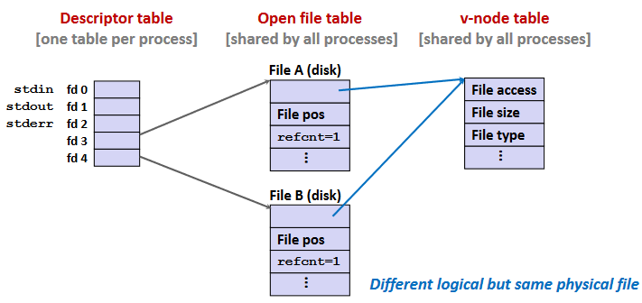
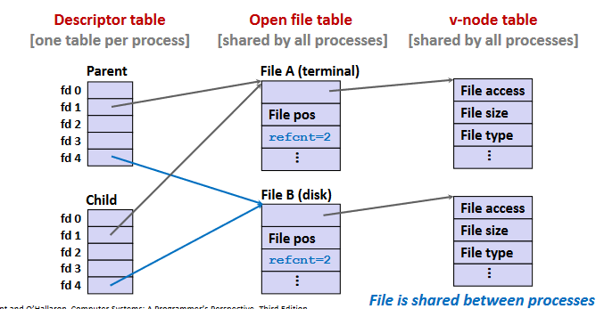
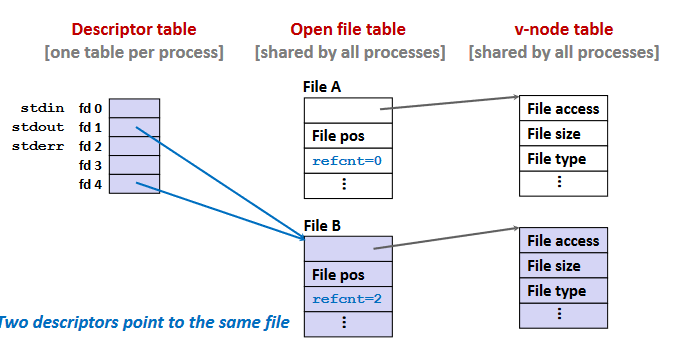

# 1. Unix I/O
Unix的read()、write()函数返回值可能小于要求值，其并非错误，应该继续不断调用read()、write()处理剩下的内容。

可用readn()、writen()、readline()避免这种情况，特别是Web服务器中。~~~~

# 2. 共享文件
内核用三个数据结构表示打开的文件：

* **描述符表（descriptor table）：**每个进程都有独立的描述符表，以描述符为索引，指向文件表的一个表项。

* **文件表（file table）：**表示打开的文件，有偏移量，v-node指针等信息，该表*所有进程共享*。每次 *open()* 都有一个独立的对应文件表表项。

* **v-node表（v-node table）：**所有进程共享。包含stat结构中的大部分信息。

同一进程多次调用 *open()* 打开同一文件，会有不同的描述符和文件表标项，但v-node是同一个。

fork后子进程继承父进程的符号表

# 3. I/O重定向
I/O重定向可用 *dup2()* 实现。

执行 dup(4,1) 后将fd1指向fd4对应的文件表项 File B，并删除表项 File A 及其 v-node。

直到所有相关的描述符被关闭，文件表项才会被删除。

# 4. 标准I/O
由libc提供的I/O为标准I/O，尽可能都使用标准I/O。
且对网络套接字应使 *readn()* , *writen()* 等函数。

标准I/O的输出函数将输出内容放于缓冲区，在缓冲区遇到换行符或缓冲区满时才输出其中的内容。
因为标准I/O的全双工性质，所以要注意如下：
* 跟在输出函数后的输入函数，中间要有 *fflush()*
* 跟在输入函数后的输出函数，中间要有 *fseek()*