# 基础

## 特权级

CPU 运行状态分不同特权级（priviledge level），一些特权指令（如修改页表地址、开关中断）只能在对应特权级运行，否则会触发异常

* 用户态（user-mode）

* 内核态（kernel-mode）
  
  

从用户态 trap 到内核态的场景

* **中断**（interrupt）：硬件引起

* **异常**（exception）：当前软件指令引起（如访问未映射内存引起 page fault）

* **系统调用**（syscall）：调用操作系统的系统调用
  
  * 使用系统调用指令触发（如 RISC-V 的`ecall`）
  
  * 使用寄存器传递系统调用号与参数
  
  * 内核需要检查用户传递的参数指针，防止安全问题
    
    * 不能指向内核内存（攻击）
    
    * 不能指向未映射区域（防止在内核中引起 page fault）
  
  * 系统调用开销主要来自模式切换，去掉切换提升调用性能
    
    * VDSO（Virtual Dynamic Shared Object）：内核与用户共享一块内存空间，直接交换数据
    
    * FlexSC：共享一块 syscall page 作为队列，用户 push，内核线程 pull

## 特权级切换

特权级切换由 CPU 硬件与软件结合而成，不同硬件实现不同（ARM CPU 会自动切换栈指针 SP，RISC-V 必须在处理函数中软件设置）

1. CPU 自动执行将程序计数器 PC 设置到注册的内核处理函数、保存应用程序的旧 PC、设置 trap 原因等操作

2. 内核的处理函数保存其他来自应用程序的状态（如把通用寄存器保存到内核栈）

3. 执行处理函数

4. 内核恢复应用程序状态，并调用对应指令（如 RISC-V 的`sret`）切换到用户态

# 内存管理

## 页表

* 多级页表减少页表体积，大部分页表不需要存在

* 页表项（page table entry）除了包含物理地址，还有有效位、权限信息等

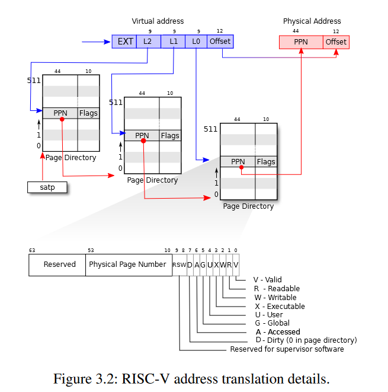

## TLB

MMU 使用 **TLB**（Translation Lookaside Buffer）用于缓存页表，避免多级查找

* 将虚拟页号映射到物理页号
* hit 不查页表
* miss 查页表并更新 TLB，TLB 如果满了进行置换

不同进程中，相同的虚拟地址会映射到不同的物理页。切换进程（即切换页表）时需要刷新 TLB 避免混淆页表项。优化方式：

* **ASID**（Address Space IDentifier）为缓存项打标签，每个进程一个 ASID，对应的 TLB 项也标记 ASID，避免混淆省去 TLB 刷新
* **Global TLB**：不同进程共享的部分（内核空间）可放入全局 TLB，避免多余的 TLB miss，使用表项 nG 位标志

## VMA


Linux 使用段（VMA，Virtual memory area）管理进程连续的虚拟内存

* **访问非法地址（非 VMA）触发 seg fault**
* `/proc/{id}/maps`查看
* 进程建立时为代码段、数据段等建立 VMA
* 进程运行时`mmap()`，`brk()`也会影响 VMA

## 延迟映射

**demand paging**：程序运行需要时才从磁盘读取内容到物理内存，并建立页表映射

* 访问未映射内存，触发 page fault 后建立映射
* 通过 prefetch 一次读取多页，避免反复 page fault

page fault 可能由不同原因引起，相应区分方法：

1. 访问非法地址（seg fault）：检查该地址不在 VMA 中
2. 按需映射（demand paging，数据尚未被读入内存）：swap 记录不存在该页
3. 访问的数据被 swap out 到磁盘：swap 记录中有该页

## swapping

使用磁盘解决物理内存不足

* swap out：物理页移到磁盘
  * 将某进程的物理页移到磁盘，并记录页在磁盘的位置
  * 页表项设置为**未映射**
* swap in：磁盘物理页移入内存
  * 访问未映射的内存触发 *page fault*
  * page fault handler 中将磁盘的内容重新放入物理内存，修改页表项建立映射
  * prefetch 一次换入多个相邻页，减少 page fault 次数（时空局限性）
* 页替换策略：空闲物理页不足以 swap in 时，替换某些物理页
  * FIFO、LRU/MRU、Clock Algorithm ……
  * 错误的替换策略会导致频繁的 swap in/out，影响性能（thrashing 现象）
  * 工作集（work set）为程序 *一段时间内* 使用的所有页集合，swap out 时应尽量选择非工作集的页

## 物理内存分配

操作系统需要考虑物理内存及其分配的情况

* 创建新进程，需要分配物理页并建立映射（页粒度）
* 内核有时需要直接从物理内存为数据结构分配空间（`kmalloc()`）
  * 申请的不一定是页粒度，可能更细
  * 如果像应用一样申请虚拟内存（`vmalloc()`），会在内核触发 page fault 性能不佳
* DMA 只能访问连续的物理内存
* swapping
  
  

物理内存管理方法

* bitmap：以页为单位申请，bitmap 标记是否空闲
  
  * 容易产生碎片

* 伙伴系统（buddy system）：申请时拆分空闲伙伴块，回收块时与相邻、等大小的空闲的伙伴块合并
  
  * 伙伴系统能避免外部碎片，但内部碎片较大（申请9K，分配16K）
  
  * Linux 中使用使用 slab/slub/slob，在伙伴系统基础上更细粒度分配，避免内部碎片从伙伴系统获取大块内存
    
    * 将均分为等份大小的 slot（细于4K），使用空闲列表进行分配管理


## 扩展功能

* 共享内存：不同进程中的虚拟内存映射到相同的物理内存
  
  * 进程间通信
  
  * 节省内存（共享库）

* 写时拷贝（copy-on-write）：不同进程映射相同物理内存并设置页表项权限，写时引发 page fault 进行复制并重映射
  
  * 节约内存
  
  * 减少不必要复制

* 内存压缩：内存不足时，将 “最近不太会使用” 的内存页压缩，释放空间
  
  * 通常压缩后依然放在内存，可以减少 swap out 时的 I/O 总量

* 大页（huge page）：大于 4K 的页
  
  * 减少页表项数量，增加 TLB 命中率
  
  * 减少页表级数，增加访问效率

* 内存去重（memory deduplication）：扫描相同内容的物理页面，修改对应进程页表将其变成 copy-on-write
  
  * 对用户透明

# 进程与线程

* 进程
  
  * PCB（Process Control Block）、TCB 保存进程和线程各种元数据
    * linux 皆为`struct task_struct`
  * 每个进程都有各自的内核栈
    * 进程进入内核态时也可被抢占，需要独立内核栈以恢复

* 上下文切换（Context Switch）
  
  1. 应用通过系统调用或中断进入内核态
  
  2. 内核态中将应用状态（寄存器）保存到内核栈
  
  3. 选择调度的进程，从其内核栈中恢复应用状态
  
  4. 回到用户态执行

# 调度

经典调度策略

* FIFO
  
  * 后到任务响应时间过长

* 短任务优先（Short Job First）
  
  * 长任务可能被饿死

* 时间片轮转（Round Robin）
  
  * 任务结束时间会被拖后，体验可能不好

## 多级反馈队列

多级反馈队列（Multi-level Feedback Queue，MLFQ）多个不同优先级的队列，高优先级队列先执行，队列内同优先级任务采用轮转

MLFQ 根据任务运行情况动态调整其优先级，保证短任务（交互、I/O）相对于长任务（计算密集型）的优先响应

* 高优先级抢占低优先级

* 新任务最高优先级（保证新任务快速响应）

* 随运行时间降低优先级（如果是计算密集型任务则不在乎响应时间）

* 一段时间后所有任务重设为最高优先级（防止长任务饿死）

* 低优先级任务时间片长（减少调度开销）

## 公平份额调度

公平份额（Fair-share）调度为每个任务分配权重 ticket，任务根据 ticket 比例占用资源（两个任务 A 有 75 ticket，B 有 25 ticket，则 A 占 75% CPU）

该方法难以结合 I/O 与计算任务应得 ticket，只适用于容易确定任务份额的特定领域（如虚拟数据中心给贵的虚拟机分配更多资源）

## 多处理器调度

多处理器调度的问题

* 多个 CPU 共享一个调度器数据结构会产生竞争

* 缓存亲和性（cache affnity）：CPU 运行任务时缓存中维护了许多状态，应尽可能保持任务在同一 CPU 上避免重新加载
  
  

Two-level scheduling 中每个 CPU 都有独立的调度器，避免竞争问题

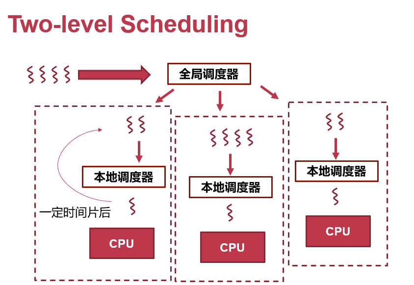

## Linux 调度器

Linux 有两种调度器，每个又有不同的调度策略

* Complete Fair Scheduler（CFS）：公平分配 CPU 给所有任务
  * 计算每个任务实际运行时间 vruntime，选择 vruntime 最小的任务执行（保证公平）
  * 使用 vruntime 作为 key 的红黑树维护任务队列
* Real-Time Scheduler（RT）

# 同步

## 锁

**所有被多线程共享的数据都需要被锁保护**


锁的实现

* 通过硬件的原子操作实现自旋锁（满足 test-and-set 或 compare-and-swap 语义的指令）

* 锁依赖机器指令在用户态实现，**加锁解锁开销不大**，除非出现争锁引起系统调用进行休眠（Linux 使用`futex`）

* 通过 fetch-and-add 实现 ticket 锁给竞争中的自旋锁排号，避免被饿死

* 使用休眠代替自旋等待

## 条件变量

条件变量使用睡眠等待条件完成，进行多线程同步协调

```c
pthread_cond_wait(pthread_cond_t *c, pthread_mutex_t *m);
pthread_cond_signal(pthread_cond_t *c);
```

* pthread_cond_wait：等待
  
  1. 解锁 mutex
  
  2. 阻塞直到条件被通知
  
  3. 重新上锁 mutex

* pthread_cond_signa：通知
  
  

为避免某些异常状态，使用条件变量应该如示例代码保证：

1. 必须使用某种额外变量（例中`count`）表示条件完成状态，在 wait 处检查
   
   * 可能因为调度 signal 先执行而 wait 后执行，如不检查 wait 可能永远无法醒来（`pthread_cond_t`无状态，不保留 ”被唤醒“ 状态，仅在 signal 时将 wait 线程放到调度就绪队列）

2. wait 处使用`while`循环而非`if`检查额外变量
   
   * wait 处可能因为 *spurious wakeup* 而被无故唤醒，但是`producer`并没进行生产
   * 可能因为 spurious wakeup 被唤起多个 consumer，虽然`producer`生产了但已被其他`consumer`消费了

3. wait 和 signal 都应该配合锁使用
   
   * 用于保护额外变量或共享资源（例中`count`）

```c
pthread_mutex_t m = PTHREAD_MUTEX_INITIALIZER;
pthread_cond_t c = PTHREAD_COND_INITIALIZER;
unsinged int count = 0;

void consumer()
{
    pthread_mutext_lock(&m);
    while (count == 0) {
        pthread_cond_wait(&c, &m);
    }
    count--;
    pthread_mutex_unlock(&m);
}

void producer()
{
    pthread_mutext_lock(&m);
    count++;
    pthread_cond_signal(&c);
    pthread_mutex_unlock(&m);
}
```

## 信号量

信号量（semaphore）用于协调线程访问有限数量的共享资源，包含两种原子操作：

* `sem_wait`
  
  * 如果 sem 可用（>0），将 sem 减 1 并继续执行
  
  * 如果 sem 不可用（<=0），将线程放入关联队列并睡眠

* `sem_post`
  
  * 如有 wait 线程正在睡眠，选一个唤醒
  
  * 如果没有睡眠线程，将 sem 加 1

## 读写锁

允许读者之间并行，读者与写者间互斥

* 偏向读者：如果写者在等待当前读者，后续读者可以直接进临界区读（示例代码）

* 偏向写者：如果写者在等待当前读者，后续读者等待写者

```c
typedef struct _rwlock_t {
  sem_t lock;      // binary semaphore (basic lock)
  sem_t writelock; // used to allow ONE writer or MANY readers
  int readers;     // count of readers reading in critical section
} rwlock_t;

void init(rwlock_t *rw) {
  rw->readers = 0;
  sem_init(&rw->lock, 0, 1);
  sem_init(&rw->writelock, 0, 1);
}

void reader_lock(rwlock_t *rw) {
  sem_wait(&rw->lock);
  rw->readers++;
  if (rw->readers == 1)
    sem_wait(&rw->writelock); // first reader acquires writelock
  sem_post(&rw->lock);
}

void reader_unlock(rwlock_t *rw) {
  sem_wait(&rw->lock);
  rw->readers--;
  if (rw->readers == 0)
    sem_post(&rw->writelock); // last reader releases writelock
  sem_post(&rw->lock);
}

void writer_lock(rwlock_t *rw) { sem_wait(&rw->writelock); }

void writer_unlock(rwlock_t *rw) { sem_post(&rw->writelock); }
```

## RCU

RCU（Read-Copy-Update）借助一些现代 CPU 对**单地址读写**（读写一个指针）的原子性，保证不需要锁的情况下读写也可以正常并发执行

* 读写并发执行，读者要么读到新值要么读到旧值（不在乎数据时效性）

* 适用于多读者频繁读、极少写的情况。避免读写锁中读者锁的开销，以及读者被写者锁挡住的情况
  
  

因为只对单地址读写有原子性，要更新大量数据时需要先拷贝，对副本修改后通过修改指针的方式替换原数据

```c
routing_table *newrt = copy_routing_table(rt);
update_routing_table(newrt);
rcu_assign_pointer(&rt, newrt);
```

## 死锁


```c
mutex_t m1, m2;

void p1 (void *ignored) {    
  lock (m1);
  lock (m2); /* deadlock here */
/* critical section */
  unlock (m2);
  unlock (m1);
}

void p2 (void *ignored) {
  lock (m2);
  lock (m1); /* deadlock here */
/* critical section */
  unlock (m1);
  unlock (m2);
}
```

死锁（deadlock）：线程都在等待其他线程释放资源（以锁为例），而导致所有线程无限阻塞

* 死锁的产生时必须同时满足的条件
  
  * 循环等待：线程形成环路，每个都持有其他线程需要申请的资源（锁）
  
  * 非抢占：线程持有的资源不能被其他线程抢占
  
  * 持有并等待：线程获取资源后，又等待其他资源
  
  * 互斥：资源一次只能被一个线程占用

* 针对产生条件的设计时预防
  
  * 循环等待：资源编号，所有线程按相同的特定顺序获取
  
  * 非抢占：允许资源被抢占（比较复杂，需要将被抢占的线程进行恢复）
  
  * 持有并等待：一次性申请所有资源（使用`trylock`一次性获取所有锁）
  
  * 互斥：给每个线程拷贝一份资源

* 调度器通过分析线程将占用的资源，进行运行时预防
  
  * 如银行家算法

* 运行时检测死锁并进行恢复
  
  * 如检测到死锁直接重启
    
    

活锁（livelock）：线程没有阻塞，但因不断执行 ”尝试资源--失败--尝试资源--失败“ 而无法正常运行

* 例如通过`trylock`尝试一次性申请多个锁时会发生

* 一段时间后可能通过调度解开

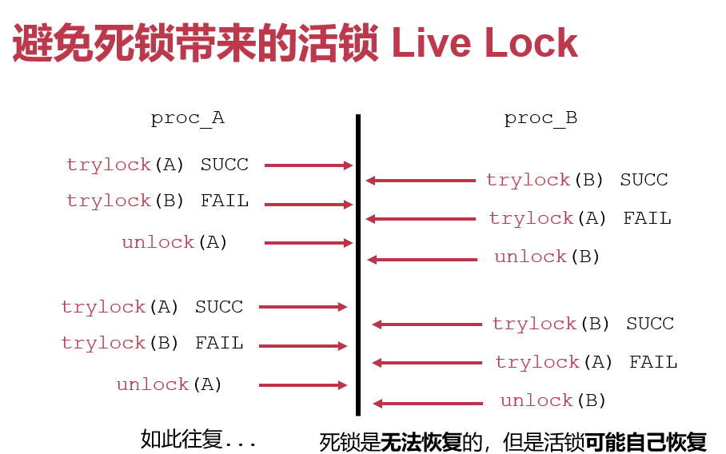

# 文件系统

## inode 文件系统

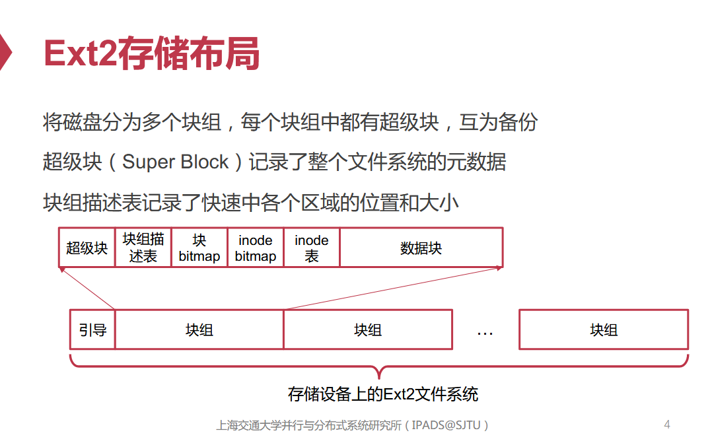

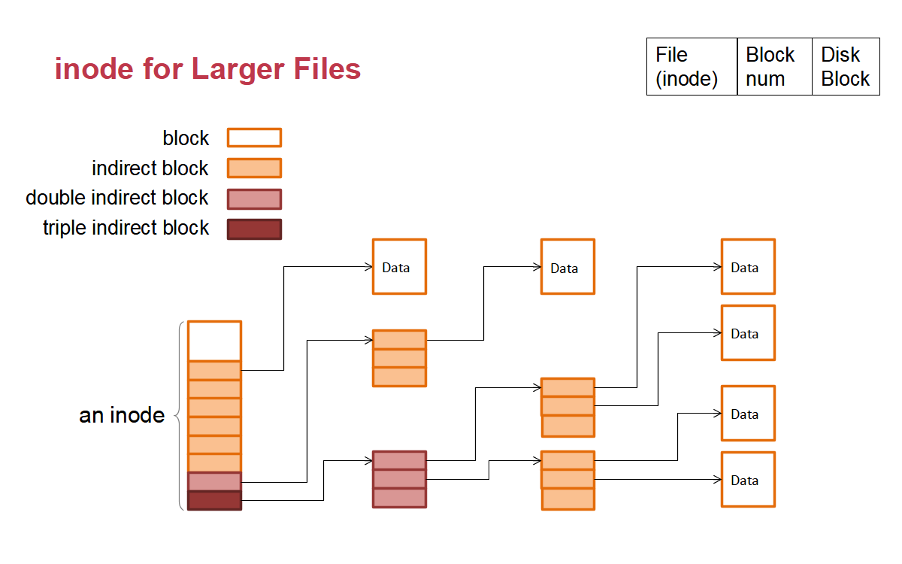

一个 inode 表示一个文件，文件系统通过 inode 访问实际数据

* data bitmap 与 inode bitmap 记录块使用情况

* inode 结构保存文件元数据与 data block 的指针（多级指针避免结构臃肿）

文件与目录

* 目录也是文件，内容是文件名到 inode 的映射表

* 文件名保存在目录中，而非 inode 结构

* hard link 在父目录中创建指向目标 inode 的映射项（共享 inode）

* soft link 符号文件保存目标路径的字符串

## VFS 与 缓存

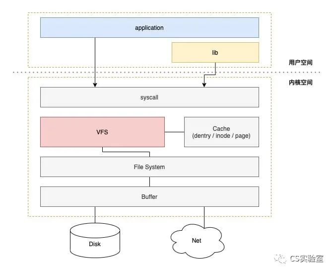

VFS（Virtual File System）提供抽象由具体文件系统实现，从而允许系统支持多种文件系统

* 文件描述符
  * VFS 为每个进程维护文件描述表，文件描述符作为索引
  * 表项中包含打开文件的 inode、读写位置等信息
* VFS 维护统一的文件树，其他文件系统挂载其上
* VFS 在内存中维护 inode 缓存（icache），VFS inode 中保存了页缓存的索引
* VFS 在内存中为文件名到 inode 号建立缓存（dcache）

打开的文件会在内存中建立**页缓存**（page cache），减少磁盘读写

* 使用`fsync()`将脏页写回磁盘
* 打开文件时使用`O＿DIRECT` 取消页缓存

## 崩溃一致性

写文件涉及多个步骤（写 inode、写空闲 bitmap、写数据块），过程中如果崩溃，重启后需要错误恢复机制保证数据一致性。保证崩溃一致性的方式：

* fsck
  
  * 扫描文件系统的元数据、inode、空闲块 bitmap 等，遇到异常进行修复
  
  * 需要扫描整个文件系统，速度慢

* journaling
  
  1. 修改内容写入文件系统的日志（此时崩溃，恢复时直接丢弃）
  
  2. commit
  
  3. 日志内容更新到磁盘（此时崩溃，恢复时重新从日志更新）
  * 使用 journaling 会写入两次（一次日志、一次实际数据），需要在一致性与性能间权衡

* copy-on-write
  
  1. 复制要修改的块，在副本进行修改
  
  2. 进行原子修改
  
  3. 回收资源

* soft update
  
  * 对文件系统的所有写入排序，以确保磁盘上的结构永远不会处于不一致的状态

## Log-structured File System

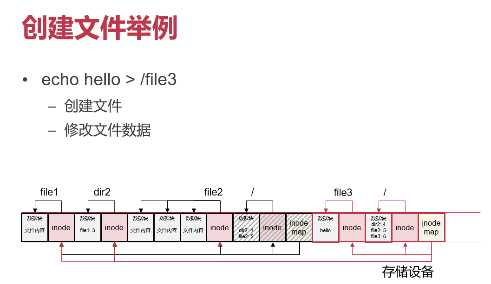

磁盘上顺序写入速度大于随机写入。LFS 不修改原始内容（inode 和 数据块），而是在尾部未使用区追加修改。

* 内存缓冲区满时，一次性顺序写入磁盘尾部，写入的单位为 segment
* 修改的 inode 结构连带修改的 imap 随数据块一起写入
  * imap 将 inode 号映射到 inode 结构的地址，一个 segment 对应一个 imap
  * 通过文件系统上固定的 CR（checkpoint region） 来找到各 imap，CR 间隔式更新减少 I/O
* 读文件时通过 CR 找到 imap 再找到 inode，读取数据块
  
  

文件被修改后，前面无效化的块需要被回收（不回收可用于实现版本回退）

1. 以 segment 为单位，找出其中的有效数据，移到其他 segment 中

2. 将有效数据移到其他 segment 中

3. 将原 segment 标记为空闲
   
   

LFS 通过 CR 实现崩溃恢复

* 修改 CR 时崩溃：有主备 CR，通过比较时间戳选择最新可用的 CR

* 修改 log 时崩溃：通过 CR 找到最新可用的 imap，实现恢复
  
  

## Flash

闪存操作

* 读：page（2K/4K）为单位
  
  * 随机访问速度快

* 擦除：block（128K/256K）为单位
  
  * 擦除后变为全 1
  
  * block 的擦除次数有限

* 写：page 为单位
  
  * 写入前需擦除，为防原有数据丢失必须先转移到其他地方
    
    

FTL（Flash Translation Layer）将逻辑块号转换到物理块号，可由软件或硬件实现

* 大部分采用 log-structured 方式实现，写入时不修改原 page 而是追加在新 page，避免反复擦除

* 实现磨损均衡、垃圾回收等功能
  
  

## 用户态文件系统 FUSE

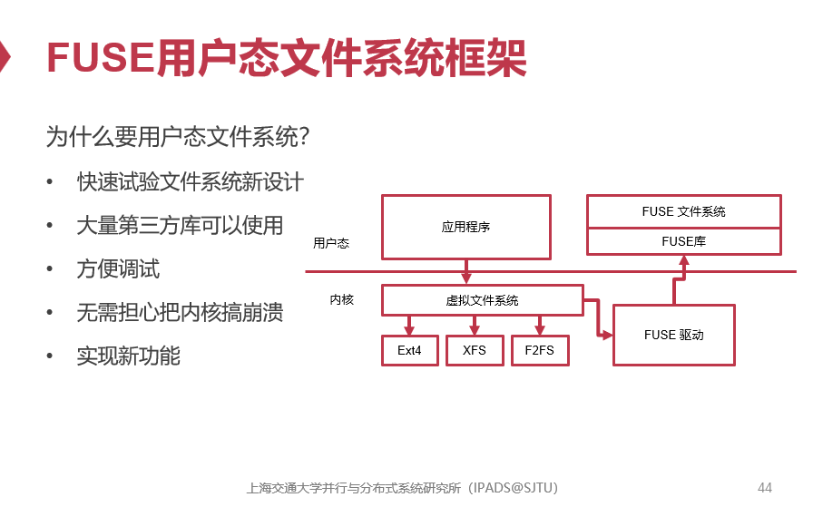

- [ ] 

# 设备管理

* 设备与 CPU 通过总线（bus）相连
  
  * 消息在总线上广播（每个设备都能收到），通过某种仲裁协议进行协调

* CPU 访问设备寄存器进行交互的方式
  
  * MMIO（Memory-Mapped I/O）：寄存器映射到内存地址上，使用内存访问指令（load/store）
  
  * PIO（Port I/O）：设备有独立的地址空间，使用专门的 I/O 指令（in/out）

* DMA（Direct Memory Access）允许设备直接读写物理内存，过程中无需 CPU 参与

## 设备与中断

Linux 下的中断处理

* 上半部：完成必要且轻量的操作，调用`request_irq()`设置的硬中断处理程序把具体的处理任务交给下半部，以便继续接收硬件中断

* 下半部：完成剩余的复杂任务，Linux 有多种下半部机制
  
  * softirq：有独立上下文环境，可以被硬中断打断、多核并行的可重入函数。没有进程上下文，不可睡眠（调度器找不到它）
  
  * tasklet：类似 softirq，但是可以被动态注册，不可多核并行
  
  * work queue：将工作加入队列，又可被调度的内核线程执行
    
    

高频设备（如网卡）下频繁中断切换上下文开销大，解决方法

* 系统在发生中断后进行一段时间的轮询（Linux NAPI）

* 中断合并（interrupt coalescing）：设备中断累积到一定阈值或到达 timeout，才向 CPU 发中断

## Linux 设备驱动模型

三种设备抽象

* 字符设备（char device）：设备上的信息抽象为流
  
  * 可以使用`open()`、`read()`、`write()`等
  
  * 主设备号（major）识别驱动类型，次设备号（minor）识别设备

* 块设备（block device）：以块为粒度随机读写
  
  * 块设备的访问通常通过页缓存（page cache）减少 I/O

* 网络设备（network device）：处理网络 packet，使用套接字操作
  
  

内核使用以下结构维护设备驱动模型，内核使用`kobject`表达这些结构并层次化管理

* device：硬件的抽象

* driver：驱动程序的抽象

* bus：抽象设备与 CPU 的通信，所有设备至少要连接一条总线（usb，pci）

* class：相似设备的集合，用于抽象可以在设备间共享的数据结构和函数接口

Linux 通过 sysfs （`/sys`）将这些`kobject`的信息展示出来

* block：所有可用块设备（磁盘、分区）

* fs：已挂载的文件系统

* bus：系统的总线

* devices：连接设备的层次结构

* firmware：来自固件的信息

* class：连接设备的类型

* kernel：内核状态

* module：加载的内核模块

* power：电源管理子系统

## Linux 网络协议栈

* `struct sk_buff`（skb）用于内核中管理各层网络数据包
  
  * 不直接保存数据，而用指针指向报文内存
  
  * 在协议层中传递时，修改指针指向整个报文中该层协议头部位置

* 收包流程
  
  1. 网卡通过 DMA 将报文拷到内核缓冲区（RX Ring），产生中断通知
  
  2. CPU 收到中断，在 handler 中调用网卡驱动分配 skb，剩余下半部任务交给 softirq
  
  3. 内核协议栈逐层处理 skb，最后根据 socket 唤醒用户进程
  
  4. 应用从内核空间将 skb 的数据拷贝到用户空间

* 发包流程
  
  1. 把数据从用户空间拷贝到内核，分配对应的 skb
  
  2. 协议栈逐层封装报头
  
  3. 网卡通过 DMA 将发送队列（TX Ring）的数据发出

# 虚拟化

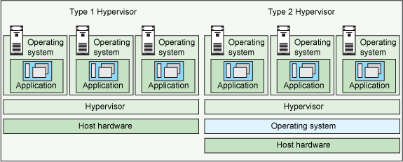

虚拟机监控器（hypervisor）类型

* type-1 hypervisor：直接运行在硬件上
  
  * 充当操作系统管理硬件资源，性能更好
  
  * Xen， VMware ESX Server

* type-2 hypervisor：运行在操作系统上
  
  * QEMU，KVM

## CPU 虚拟化

虚拟化执行程序流程（trap & emulate）

1. 虚拟机（guest OS 和 应用）运行在 CPU 用户态特权级（如 ARM 的`EL0`）

2. 用户态的虚拟机执行敏感的系统指令（设置页表寄存器、设置特权级寄存器、控制外设等）时引起异常 trap 到 hypervisor

3. hypervisor 模拟（emulate）虚拟的 CPU、内存、外设来处理该系统指令

4. 返回虚拟机继续执行
   
   

有的处理器在用户态执行敏感指令不会出现异常 trap（如 AArch32 用户态下使用`cps`设置中断相当于 NOP），hypervisor 需要方法弥补这些不可虚拟化的指令

* 解释执行（emulate）：软件模拟每一条虚拟机的指令，性能开销大

* 二进制翻译（binary translation）：将不可虚拟化指令翻译成模拟函数，当 PC 指针遇到这些指令时直接执行模拟函数代码

* 半虚拟化（para-virtualization）：修改 guest OS 代码，把其中不可虚拟化指令换成 hypervisor 的调用代码

* 换支持硬件虚拟化的处理器，除了用户态和内核态特权级还包含了对 hypervisor 状态的支持
  
  * AArch64 下增加`EL2`运行 hypervisor，虚拟机的 OS 和应用不用修改继续在`EL1`和`EL0`运行
  
  * Intel 下区分 root（hypervisor）和 non-root 模式，每个都各有 ring0-3 的权限级

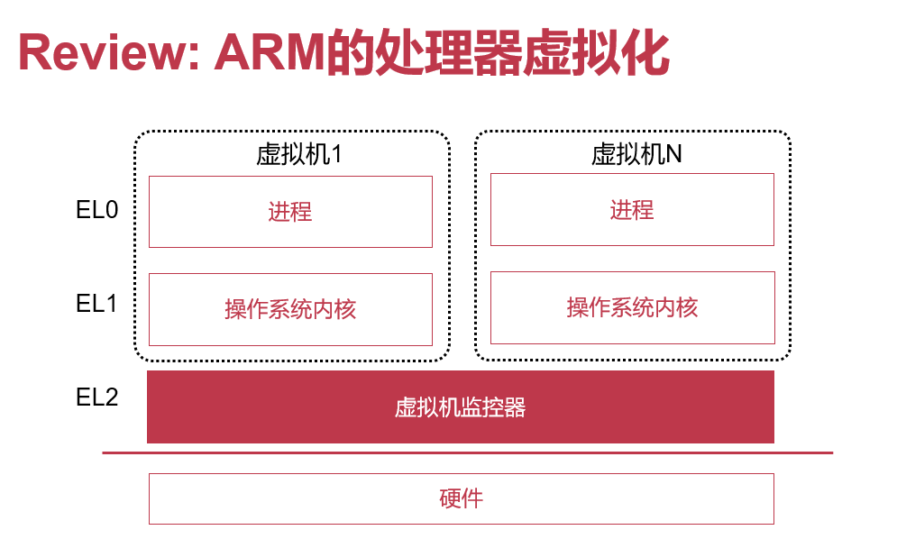

## 内存虚拟化

虚拟化中的三种地址，最终 guest 地址都要被映射为 host 的物理地址

* 客户虚拟地址（Guest Virtual Address，GVA）：虚拟机的进程使用的虚拟地址

* 客户物理地址（Guest Physical Address，GPA）：虚拟机的 guest OS 管理的假物理地址

* 主机物理地址（Host Physical Address，HPA）：hypervisor 管理的设备真实物理地址

### 影子页表

没有硬件虚拟化的设备 MMU 只有一个页表，既要给`EL1`的 hypervisor 使用，也要给`EL0`的虚拟机里的客户程序翻译 GVA，shadow page table 可以同时满足：

1. 虚拟机的 guest OS 向页表寄存器配置 GVA 到 GPA 的页表，触发异常 trap 到 hypervisor

2. hypervisor 维护虚拟机的 GPA 到 HPA 的映射，将上述页表中的 GPA 替换成 HPA，设置页表到寄存器

3. 虚拟机的客户程序的 GVA 运行时被 MMU 翻译成 HPA

### 直接映射

影子页表需要在 guest OS 操作页表时 trap 到 hypervisor，有性能开销。

direct paging 修改 guest OS 代码使其可以与 hypervisor 通信（半虚拟化），使其为客户应用程序设置页表时直接使用 GVA 到 HPA 的映射

### 硬件支持

硬件上支持多阶段页表，地址翻译又 MMU 直接执行

* stage-1 page table：GVA 映射到 GPA，由 guest OS 设置

* stage-2 page table：GPA 映射到 HPA，由 hypervisor 设置

## I/O 模拟

* 软件模拟
  
  * 捕获 guest OS 的 MMIO 或 PIO 动作，交给软件模拟的设备
  
  * 可以使用原生驱动，但性能较差

* 半虚拟化
  
  * 虚拟机知道自己运行在虚拟环境中，直接调用 hypervisor 提供的前端驱动与 hypervisor 通信

* 设备直通
  
  * 允许虚拟机直接与硬件通信
  
  * 为防止虚拟机恶意操作硬件，使用 IOMMU 管控 guest OS 能访问的设备物理地址，阻止对任意地址的非法访问

## QEMU/KVM

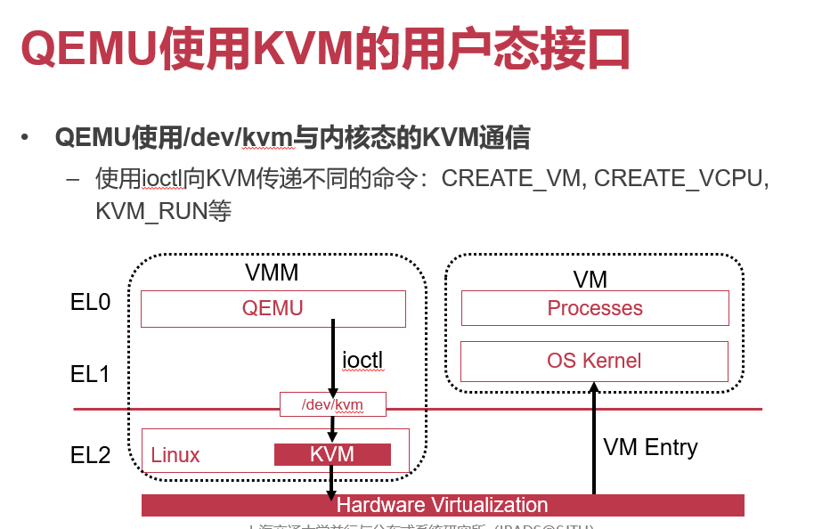

* QEMU/KVM 架构中
  
  * KVM 作为 hypervisor 为虚拟机提供与管理虚拟化的 CPU 和内存，虚拟机涉及到外设的动作会被转交给 QEMU
  
  * QEMU 为设备提供虚拟化外设

* 流程
  
  1. QEMU 使用`CREATE_VM`等让 KVM 创建虚拟机，使用`KVM_SET_USER_MEMORY_REGION`等设置虚拟机代码
  
  2. QEMU 使用`KVM_RUN`让 KVM 设置各项寄存器并执行虚拟机
  
  3. 虚拟机遇到 I/O 指令 trap 到 KVM，KVM 再通知 QEMU 处理虚拟化外设的动作

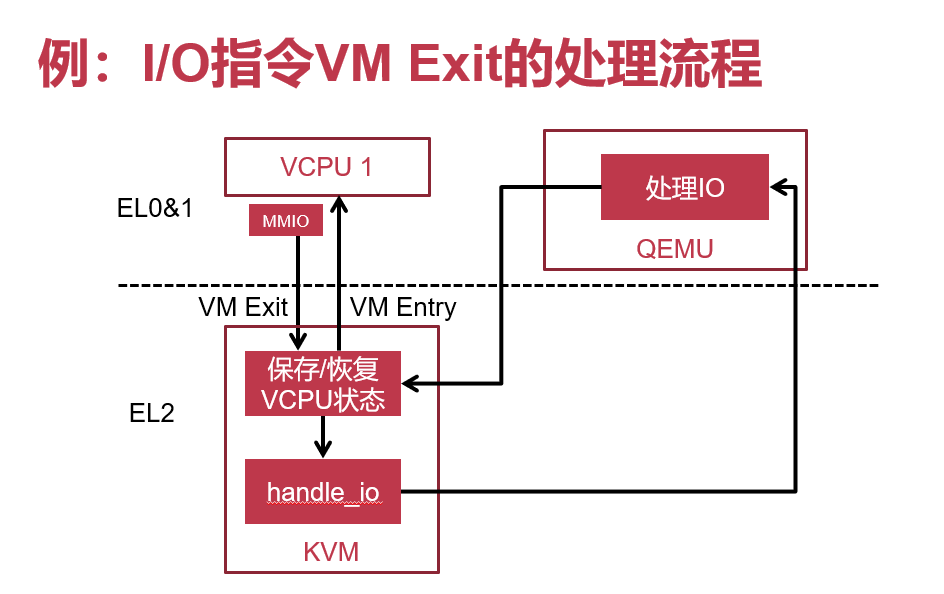
